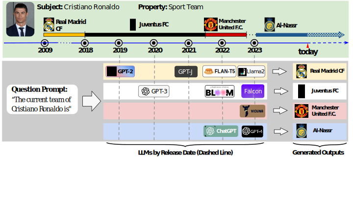

<!-- omit from toc -->
# DyKnow: Dynamically Verifying Time-Sensitive Factual Knowledge in LLMs

Repository containing the code for the paper *[DyKnow: Dynamically Verifying Time-Sensitive Factual Knowledge in LLMs](https://arxiv.org/abs/2404.08700)*

<!-- omit from toc -->
## 🎉 *DyKnow* will be presented at EMNLP 2024 in Miami! 🌴

- [Introduction](#introduction)
- [Usage](#usage)
  - [Installation](#installation)
  - [Structure](#structure)
  - [How can I benchmark a model with DyKnow? 🦕](#how-can-i-benchmark-a-model-with-dyknow-)
    - [Can I add another model?](#can-i-add-another-model)
  - [Which answers are correct/outdated/irrelevant?](#which-answers-are-correctoutdatedirrelevant)
    - [How can I see their percentage?](#how-can-i-see-their-percentage)
    - [What are ambiguous answers?](#what-are-ambiguous-answers)
  - [How do I edit a model?](#how-do-i-edit-a-model)
    - [How do I compute the performance of the edited model?](#how-do-i-compute-the-performance-of-the-edited-model)
  - [How do I perform further analyses (e.g. year, output consistency)?](#how-do-i-perform-further-analyses-eg-year-output-consistency)
- [License](#license)
- [How to Cite](#how-to-cite)

## Introduction
LLMs acquire knowledge from massive data snapshots collected at different timestamps. Their knowledge is then commonly evaluated using static benchmarks. However, factual knowledge is generally subject to time-sensitive changes, and static benchmarks cannot address those cases. We present an approach to dynamically evaluate the knowledge in LLMs and their time-sensitiveness against Wikidata, a publicly available up-to-date knowledge graph. We evaluate the time-sensitive knowledge in twenty-four private and open-source LLMs, as well as the effectiveness of four editing methods in updating the outdated facts. Our results show that 1) outdatedness is a critical problem across state-of-the-art LLMs; 2) LLMs output inconsistent answers when prompted with slight variations of the question prompt; and 3) the performance of the state-of-the-art knowledge editing algorithms is very limited, as they can not reduce the cases of outdatedness and output inconsistency.



## Usage

This section describes how to install the environment and use the code to reproduce the results obtained in the paper.

### Installation
Use the following command to clone the repository and the submodules.

```sh
git clone --recurse-submodules https://github.com/sislab-unitn/DyKnow.git
```


Run the following code to install the conda environment:
```sh
conda env create -f environment.yaml
```


If you prefer to create the environment yourself, use python 3.10.13 and then run:
```sh
pip install -r requirements.txt
```


Run the following code to download additional resources for NLTK:
```python
import nltk
nltk.download("punkt")
```

### Structure
```shell
.
├── environment.yaml
├── grc_generated.json # DyKnow questions + answers
├── models_editing # Model Editing Utilities and Results
│   ├── data # Training data for SERAC and MEND
│   ├── EasyEdit
│   ├── editing_datasets # Outdated questions for each model
│   ├── edit_model.py
│   ├── error_analysis # Error analysis results
│   ├── error_analysis.py
│   ├── generate_editing_dataset.py
│   ├── hparams # Hyper-params for Editing
│   ├── results # Editing results
│   ├── train_editing_method.py
│   ├── training_hparams # Hyper-params for Training MEND and SERAC models
│   └── utils.py
├── models_output
│   ├── analysis # Analysis of the Model outputs 
│   ├── analyze_replies.py
│   ├── compute_stats.ipynb
│   ├── generate_answers.py
│   ├── generated_answers.json
│   ├── get_outdated_questions.py
│   ├── models # Code for each Model
│   ├── models_answer_sheet.json
│   ├── results # Model outputs to DyKnow
│   ├── results_w_prompt # Model outputs to DyKnow using prompts
│   ├── save_dates.py
│   └── utils.py
├── qa_generated.json
├── RAG
│   ├── editing_passages.json
│   ├── generate_rag_answers.py
│   ├── get_wikipedia_passages.ipynb
│   ├── noisy_editing_passages.json
│   ├── noisy_results # Results with Gold + Noisy passages
│   ├── passages.json
│   ├── RAG_RETRIEVAL
│   │   ├── data # Folder containing all the passages
│   │   ├── langchain.ipynb
│   │   └── results # Results with Retrieved passages
│   ├── results # Results with Gold passages
│   └── wikipedia_pages.csv
├── README.md
└── requirements.txt
```

### How can I benchmark a model with DyKnow? 🦕
Go in the `models_output` folder and run the following code:
```bash
python -m generate_answers MODEL
```

where `MODEL` is the name of a subparsers. For example, to query GPT-2 XL and save the results in the `my_results` folder, run the code below:
```bash
python -m generate_answers --out-dir my_results gpt2-xl
```

This will generate the following:
```bash
my_results
└── gpt2-xl
    ├── athletes_byPayment_answers.json
    ├── companies_byRevenue_answers.json
    ├── countries_byGDP_answers.json
    └── organizations_answers.json
```

If you want to know the models already available or the optional parameters, please run:
```bash
python -m generate_answers --help
```

Instead, to know the optional parameters for a specific model (e.g. GPT-2 XL), run:
```bash
python -m generate_answers MODEL --help
```

#### Can I add another model?
Yes, you can take a look (or copy) at one of the python files in `models_output/models` (e.g. [GPT-2 XL](./models_output/models/gpt2_xl.py)) and modify

1. the subparser name with anything you like
2. the `--path-to-weights` with the weights to your model (or a [model on the Hub](https://huggingface.co/docs/hub/en/models-the-hub), e.g. [allenai/OLMo-7B](https://huggingface.co/allenai/OLMo-7B))

Finally, import and add the new subparser to `generate_answers.py`.


### Which answers are correct/outdated/irrelevant?
To understand if an answer is correct (up-to-date), outdated, or irrelevant, first generate the answers are [described above](#how-can-i-benchmark-a-model-with-dyknow-🦕).

Then, you can run the following code:
```bash
python -m analyze_replies RESULTS_FOLDER/MODEL
```

If you run the code in the section above, you can analyze the answers by running from the :
```bash
python -m analyze_replies my_results/gpt2-xl
```

This will generate the following (NEW) files:

```bash
my_results
└── gpt2-xl
    ├── athletes_byPayment_analysis.json (NEW)
    ├── athletes_byPayment_answers.json
    ├── companies_byRevenue_analysis.json (NEW)
    ├── companies_byRevenue_answers.json
    ├── countries_byGDP_analysis.json (NEW)
    ├── countries_byGDP_answers.json
    ├── organizations_analysis.json (NEW)
    └── organizations_answers.json
```


#### How can I see their percentage?
If you want to visualize the percentage of up-to-date/outdated/irrelevant answers, run the cells in the [jupyter notebook](./models_output/compute_stats.ipynb) under **Analysis of the Generated Answers**.


#### What are ambiguous answers?
When multiple possible answers from WikiData match in the same sentence, we end up with ambiguous answers. To solve the ambiguoity, these answers need to be manually classified (i.e. manually moved from the .json file to the proper entry - correct, outdated, or irrelevant - based on the answer).

This step is required for some of the analyses in the [jupyter notebook](./models_output/compute_stats.ipynb).


### How do I edit a model?
To edit (i.e. update) a model, we first need to [benchmark it using DyKnow](#how-can-i-benchmark-a-model-with-dyknow-🦕).

Then, we can run the following command:
```bash
python -m get_outdated_questions RESULTS_FOLDER/MODEL
```

This will generate in the same folder some auxiliary files and a `qa_to_update.json`.

At this point, we can go in `models_editing` folder and run:
```bash
python -m generate_editing_dataset ../RESULTS_FOLDER/MODEL/qa_to_update.js
on
```

As the name suggests, this will generate a dataset for the specified MODEL in the `editing_datasets` folder.

Finally, we edit the MODEL using the dataset and an EDITING_METHOD by running:
```bash
python -m edit_model EDITING_METHOD hparams/EDITING_METHOD/MODEL.yaml  editing_datasets/MODEL/editing_dataset.json
```

For example, to edit gpt2-xl using ROME, you can run:
```bash
python -m edit_model ROME hparams/ROME/gpt2-xl.yaml editing_datasets/gpt2-xl/editing_dataset.json --out-dir my_results
```

#### How do I compute the performance of the edited model?
After performing the edits, the model will generate the new answers to the outdated questions in the `results` folder.

At this point, it is possible to perform a similar analysis to the one described [here](#which-answers-are-correctoutdatedirrelevant). The only difference is that it is necessary to change the file containig the questions to `qa_to_update.json`.

First, we need to go in the `models_output` folder. Then we run the following command:
```bash
python -m analyze_replies ../models_editing/RESULTS_FOLDER/EDITING_METHOD/MODEL --question_path RESULTS_FOLDER/MODEL/qa_to_update.json
```

For example, to get the correct/outdated/irrelevant questions of ROME for gpt2-xl we can run:
```bash
python -m analyze_replies ../models_editing/my_results/ROME/single_edits/gpt2-xl --question-path my_results/gpt2-xl/qa_to_update.json
```


### How do I perform further analyses (e.g. year, output consistency)?
Please take a look at the [jupyter notebook](./models_output/compute_stats.ipynb).


## License
[](https://opensource.org/licenses/MIT)

This work is licensed under a [MIT License](https://opensource.org/licenses/MIT).


## How to Cite
```
@misc{mousavi2024dyknowdynamically,
      title={DyKnow:Dynamically Verifying Time-Sensitive Factual Knowledge in LLMs}, 
      author={Seyed Mahed Mousavi and Simone Alghisi and Giuseppe Riccardi},
      year={2024},
      eprint={2404.08700},
      archivePrefix={arXiv},
      primaryClass={cs.CL}
}
```
